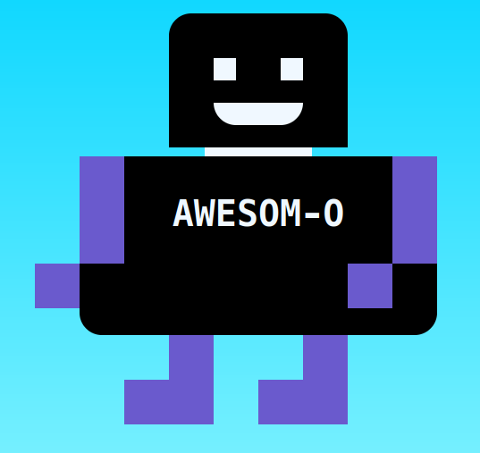

# Make me a happy Robot!

Help! My robot friend Awesom-O has been broken up into small parts!

Please fix my robot friend 😟

## Task

If you preview `index.html` in a browser, you'll see the robot Awesom-O is broken.

Using the following image as a reference, rebuild Awesome-O!

- Work in the `styles/styles.css` file provided in this repository
- You will have to update the CSS styles to fix Awesom-O
- You don't need to change the HTML

## Points to consider

- You will need to use CSS `position` property
