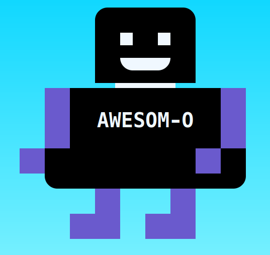

# Mach mich zu einem glücklichen Roboter!

Hilfe! Mein Roboterfreund Awesom-O wurde in kleine Teile zerlegt!

Bitte repariere meinen Roboterfreund 😟

## Aufgabe

Wenn du die `index.html` in einem Browser anschaust, wirst du sehen, dass der Roboter Awesom-O kaputt ist.

Verwende das folgende Bild als Referenz, um Awesom-O wieder aufzubauen!

- Arbeite in der `styles/styles.css` Datei, die in diesem Repository bereitgestellt wird
- Du musst die CSS-Stile bearbeiten, um Awesom-O zu reparieren
- Du musst das HTML nicht ändern

## Punkte, die zu beachten sind

- Du musst die CSS `position` Eigenschaft verwenden
